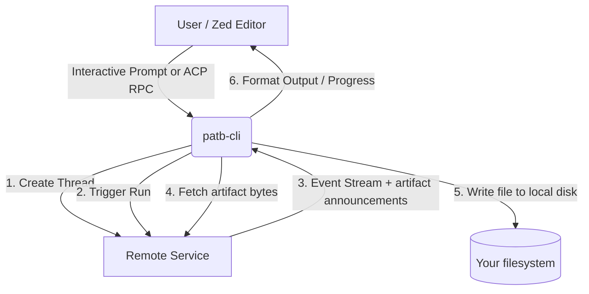

# Pinky and the Brain CLI (`patb-cli`)

An interactive command-line interface and **Zed Agent Connection Protocol (ACP)** bridge server for the remote "Pinky and the Brain" agent service.

With `patb-cli`, you can converse with the remote agent directly from your terminal or integrate it seamlessly into the [Zed Editor](https://zed.dev) as a custom AI assistant.

---

## Features

- **Interactive CLI REPL**: Start a direct conversation with the agent in your terminal.
- **Zed ACP Bridge**: Implements the ACP (JSON-RPC 2.0 over standard I/O) to function as a Zed-compatible external agent server.
- **Real-Time Streaming**: Supports progress notifications and real-time streaming of response chunks.
- **File Delivery**: Files the agent writes are downloaded and saved to *your* disk, not left on the server it runs on.
- **Auto-Config**: Loads configuration parameters (such as the API key) from environment variables or a local `.env` file.

---

## Architecture Overview

The CLI acts as a client wrapper and gateway for the remote server hosted at `d33ib4uu7f4xpi.cloudfront.net`. 



### Where files land

The agent runs in a container. A tool that writes with `fs` writes to *that* filesystem — a real
path, on a disk you cannot reach — which is why an article "saved" by the hosted agent used to
appear nowhere at all.

So the service does not report such a path. It publishes what it wrote as a **retrievable
artifact**: the run's event stream announces the file with its name, size and SHA-256, and this CLI
downloads it, verifies the hash, writes it to your own disk and prints where it went.

```text
💾 Saved to D:\_code-projects\articles\game-of-life.md
```

Files go to `./articles` by default, relative to wherever you started the CLI. Both the filename and
any folder the agent names arrive over the network from a language model, so writes are confined to
that directory unless you say otherwise with `--allow-any-path`. A refused write is reported, never
silent:

```text
⚠️  Could not save "aimed.md": The agent asked to write "aimed.md" to "C:\Windows\Temp", which is
    outside D:\_code-projects\articles. Re-run with --allow-any-path to permit that, or use
    --out-dir to move the directory artifacts are written to.
```

The article stays on the service either way, so a failed delivery can be retried by asking again.

---

## Installation & Setup

### Prerequisites

- **Node.js** (v20.0.0 or higher recommended)
- **npm** (comes with Node.js)

### 1. Build the CLI

Clone or navigate to the project directory and install the developer dependencies:

```bash
npm install
```

Compile the TypeScript source code to JavaScript:

```bash
npm run build
```

This compiles the code into the `dist/` directory.

### 2. Configure the API Key

The tool requires a `PATBA_API_KEY` to authenticate requests with the remote service. You can configure this in two ways:

#### Option A: Local `.env` File (Recommended)
Create a `.env` file in your current working directory (where you run the CLI command):

```env
PATBA_API_KEY=your_secret_api_key_here
```

#### Option B: Environment Variable
Export the key directly to your environment:

- **Windows (PowerShell):**
  ```powershell
  $env:PATBA_API_KEY="your_secret_api_key_here"
  ```
- **macOS / Linux:**
  ```bash
  export PATBA_API_KEY="your_secret_api_key_here"
  ```

---

## Usage

The CLI supports two primary operational modes: **Interactive REPL** (default) and **Zed ACP Bridge**.

### 1. Interactive CLI (REPL Mode)

To start an interactive conversation with the agent:

```bash
node dist/index.js
```

Or, if you link/install the CLI globally (`npm link` or `npm install -g .`):

```bash
patb-cli
```

#### Interactive CLI Controls
* **Converse**: Type your query and press `Enter`.
* **Progress Tracking**: The CLI outputs background task states (e.g., `🔄 [writerState] running`) to `stderr` so that `stdout` remains clean.
* **Exit**: Type `exit` or `quit` to end the session.

---

### 2. Zed ACP Bridge Mode

To run `patb-cli` as a background server facilitating communications between Zed Editor and the remote agent service:

```bash
node dist/index.js --bridge
# or
patb-cli --bridge
```

This mode communicates using standard JSON-RPC 2.0 protocols over `stdin`/`stdout`.

#### Configuring Zed to Use the Bridge

To add `patb-cli` as an external agent server in Zed:

1. Open Zed.
2. Open your Zed configuration file using the Command Palette (`ctrl-shift-p` or `cmd-shift-p` and type `zed: open settings`).
3. Add the server entry under the `agent_servers` block. 

Example snippet for `settings.json`:

```json
{
  "agent_servers": {
    "patb-agent": {
      "type": "custom",
      "command": "node",
      "args": ["D:/_code-projects/patb-cli/dist/index.js", "--bridge"]
    }
  }
}
```
*(Make sure to replace `D:/_code-projects/patb-cli/dist/index.js` with the absolute path to your compiled entry point, and use forward slashes `/` even on Windows).*

4. Save the settings. You can now use the Agent panel in Zed to start threads and select the `the-brain` agent.

---

## Command-Line Arguments

| Flag | Alias | Description |
|------|-------|-------------|
| `--bridge` | `-b` | Starts the server in Zed ACP JSON-RPC 2.0 Bridge mode. |
| `--help` | `-h` | Prints the CLI help menu showing usage and exits. |
| `--out-dir <path>` | | Directory files the agent writes are saved to. Default `./articles`, relative to the current directory. Env: `PATBA_OUT_DIR`. |
| `--allow-any-path` | | Permits a write outside `--out-dir` when you have asked the agent for a specific folder. Off by default. |
| `--host <url>` | | Service to talk to. Defaults to the deployed one; useful for pointing at a server running locally. Env: `PATBA_HOST`. |

If no flags are supplied, the CLI defaults to the Interactive REPL mode.

---

## Examples

### Interactive CLI Walkthrough

```text
==================================================
🧠 Pinky and the Brain - Remote Agent CLI REPL
Initializing remote session...
==================================================
🧵 Remote Thread ID: thread_abc123xyz
Type your message to prompt the agent workflow.
Type 'exit' or 'quit' to end the session.
==================================================

👤 You: How do we take over the world tonight?

🤖 Agent executing...

🔄 [instructorState] running
🔄 [writerState] running

--------------------------------------------------
🤖 Response:
Gee, Pinky, the same thing we do every night—try to take over the world!

Our plan tonight involves:
1. Building a giant electromagnetic magnet.
2. Targeting the global digital communications satellite grid.
3. Demanding 100 million dollars in exchange for restoring internet access.
--------------------------------------------------
```

### JSON-RPC 2.0 Exchange Sample (Bridge Mode)

Below is an example exchange that happens under the hood when communicating in bridge mode:

**Request (`initialize`):**
```json
{"jsonrpc":"2.0","id":1,"method":"initialize","params":{"protocolVersion":"1.0"}}
```

**Response:**
```json
{"jsonrpc":"2.0","id":1,"result":{"protocolVersion":"1.0","serverInfo":{"name":"patb-cli-bridge","version":"1.0.0"},"capabilities":{"agents":true}}}
```

---

## Troubleshooting

### 1. `Error: PATBA_API_KEY environment variable is not set.`
* **Cause**: The CLI was unable to find `PATBA_API_KEY` either in your environment variables or in a `.env` file in the directory where the command was executed.
* **Solution**: Ensure your `.env` file containing the key is in the **Current Working Directory** (`process.cwd()`) from which you are running the command, or set it as a system environment variable.

### 2. Failed to Initialize Remote Thread
* **Error message**: `❌ Failed to initialize remote thread: {"error":"401 Unauthorized"}` (or other network error).
* **Cause**: This usually indicates a network connection failure to the remote API hostname (`d33ib4uu7f4xpi.cloudfront.net`) or an invalid/expired/incorrect API key.
* **Solution**:
  - Verify your internet connection.
  - Check that the value of `PATBA_API_KEY` is correct, valid, and active.
  - Test connectivity manually using `curl`:
    ```bash
    curl -X POST -H "X-API-Key: YOUR_API_KEY" https://d33ib4uu7f4xpi.cloudfront.net/threads
    ```

### 3. Zed Fails to Load the Custom Agent Server
* **Cause**: Zed cannot find the `node` executable or the path to `index.js` in your `settings.json` is incorrect.
* **Solution**:
  - Double check that you've compiled the source files by running `npm run build`.
  - Verify that the path to `dist/index.js` is absolute and uses forward slashes `/`.
  - If using a global command, make sure `patb-cli` is in your system's `PATH`. You can verify this by running `patb-cli -h` in a new terminal window.
  - Check the Zed log files (`zed: open log` in the command palette) to see the exact error output.

### 4. `import` / module resolution errors when running `node dist/index.js`
* **Cause**: Running files without building first, or Node version discrepancies.
* **Solution**: Make sure Node.js is updated (v20+). Always run `npm run build` after editing TypeScript code.
