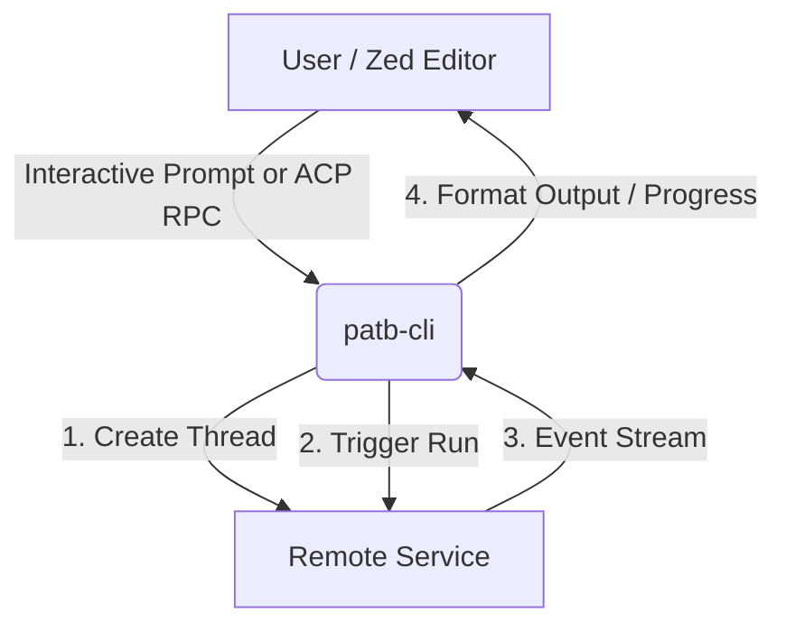
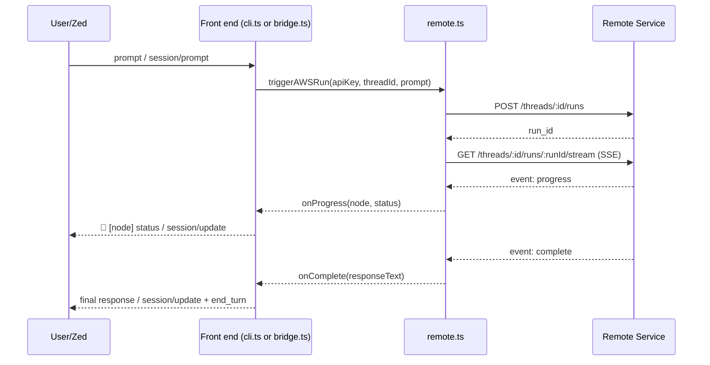

# Architecture Design

`patb-cli` is a thin client and protocol gateway in front of a remote agent service. It
does not run any agent logic locally — all reasoning happens on the remote service at
`d33ib4uu7f4xpi.cloudfront.net`; the CLI's job is to create threads, trigger runs, and
translate the resulting event stream into either terminal output or ACP JSON-RPC
messages.

## Two front ends, one remote client

Both operational modes are built on the same three remote operations exposed by
`src/remote.ts`:

1. **`createAWSThread(apiKey)`** — `POST /threads`, returns a `thread_id`.
2. **`triggerAWSRun(apiKey, threadId, prompt)`** — `POST /threads/:threadId/runs`,
   returns a `run_id`. Runs are triggered with `{ agentName: "the-brain", prompt,
   wait: false }`.
3. **`connectAWSStream(apiKey, threadId, runId, callbacks)`** — `GET
   /threads/:threadId/runs/:runId/stream` (`Accept: text/event-stream`), parsing
   Server-Sent Events and invoking `onProgress`, `onComplete`, or `onError`.

- **`src/cli.ts`** (Interactive REPL, the default mode) renders `onProgress` to
  `stderr` and the final `onComplete` text to `stdout`, then loops back to prompt for
  the next message on the same thread.
- **`src/bridge.ts`** (Zed ACP Bridge, `--bridge`/`-b`) maps each Zed `session/new` to a
  fresh remote thread, and turns `onProgress`/`onComplete` into ACP `session/update`
  JSON-RPC notifications, finishing each `session/prompt` with a `stopReason: "end_turn"`
  result. See [ACP Protocol](./acp-protocol) for the full method/notification reference.

## Response selection

The remote service's `complete` event payload can carry several different workflow
result shapes (writer/instructor/developer states, or a plain message list).
`connectAWSStream` applies a fixed priority order to pick the text to surface — see
[CLI Usage](/docs/end-user/cli-usage#how-responses-are-chosen) for the exact order.

## Configuration boundary

`src/config.ts` is the single source of truth for credentials: it loads `.env`
(without overriding real environment variables) and fails fast — before either front
end starts — if `PATBA_API_KEY` is missing. Both `cli.ts` and `bridge.ts` receive an
already-validated key from `index.ts`; neither module re-implements credential loading.
