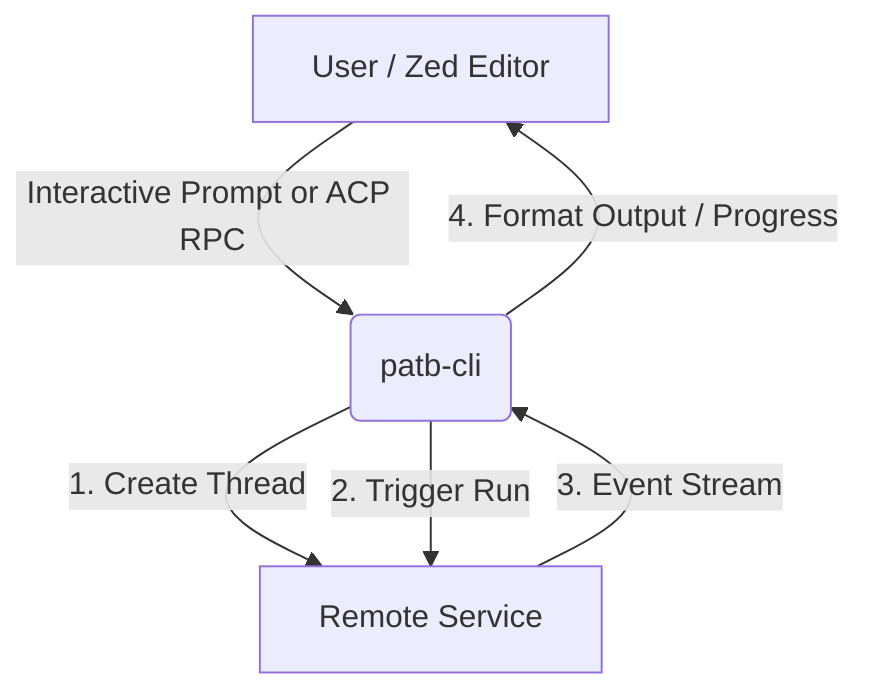

# Introduction

**Pinky and the Brain CLI** (`patb-cli`) is an interactive command-line interface and
**Zed Agent Connection Protocol (ACP)** bridge server for the remote "Pinky and the
Brain" agent service.

With `patb-cli`, you can converse with the remote agent directly from your terminal, or
integrate it seamlessly into the [Zed Editor](https://zed.dev) as a custom AI assistant.

## Features

- **Interactive CLI REPL** — start a direct conversation with the agent in your terminal.
- **Zed ACP Bridge** — implements the ACP (JSON-RPC 2.0 over standard I/O) to function as
  a Zed-compatible external agent server.
- **Real-Time Streaming** — supports progress notifications and real-time streaming of
  response chunks.
- **Auto-Config** — loads configuration parameters (such as the API key) from
  environment variables or a local `.env` file.

## Architecture Overview

The CLI acts as a client wrapper and gateway for the remote agent service hosted at
`d33ib4uu7f4xpi.cloudfront.net`:

See [Architecture](/docs/developer/architecture) for a deeper look at how the two
operational modes use this flow.

## Where to go next

- New to `patb-cli`? Start with [Installation](/docs/end-user/installation) and
  [Configuration](/docs/end-user/configuration).
- Want to use it day-to-day? See [CLI Usage](/docs/end-user/cli-usage) or
  [Zed Bridge Usage](/docs/end-user/zed-bridge-usage).
- Hit a snag? Check the [FAQ](/docs/end-user/faq) and
  [Troubleshooting](/docs/end-user/troubleshooting) guides.
- Contributing or extending `patb-cli`? Read the
  [Project Structure](/docs/developer/project-structure),
  [Architecture](/docs/developer/architecture), and
  [Source Code Reference](/docs/developer/source-code-reference).
